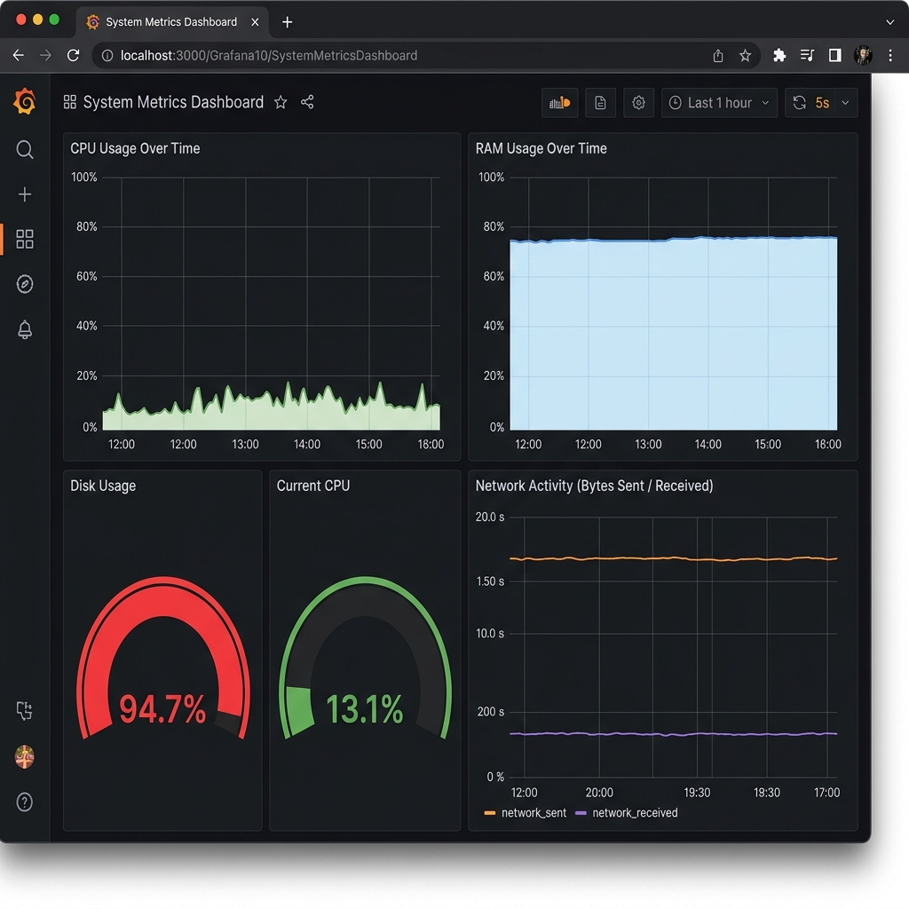
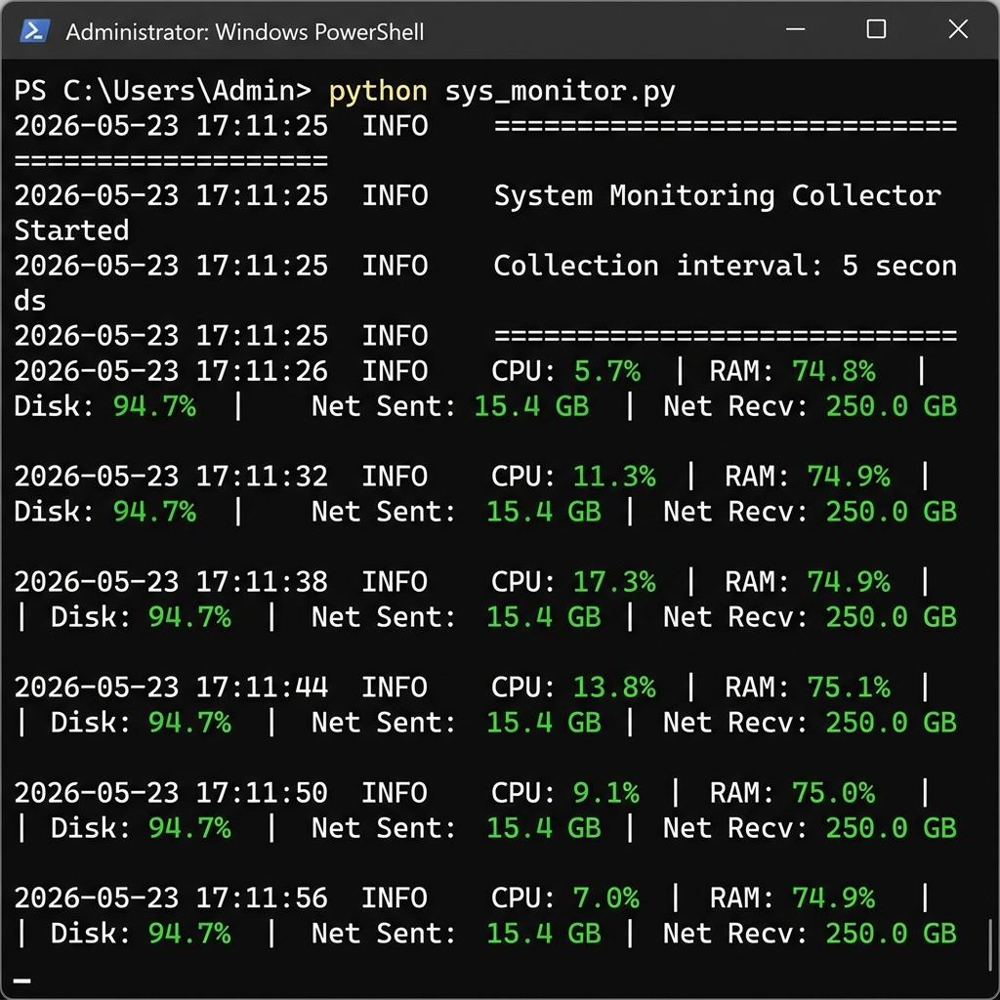
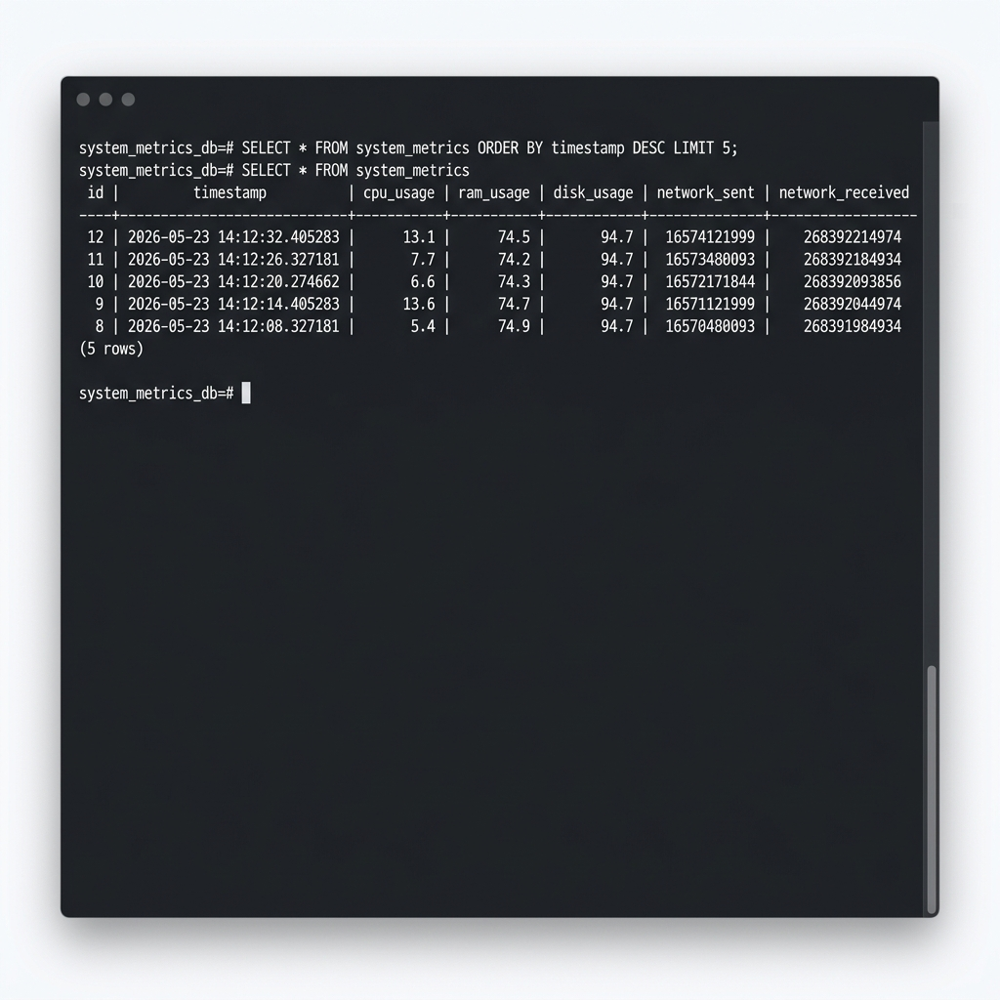

# 📊 System Monitoring & Analytics Dashboard

A real-time system monitoring application that collects local machine metrics (CPU, RAM, Disk, Network) and stores them in PostgreSQL for visualization in Grafana and analysis in Power BI.

Built as a portfolio project demonstrating **Python**, **SQL**, **data collection**, **ETL workflows**, **dashboarding**, and **containerized infrastructure**.

---

## 🛠️ Technologies Used

| Category       | Technology                          |
| -------------- | ----------------------------------- |
| Language        | Python 3.11                        |
| Database        | PostgreSQL 15                      |
| Visualization   | Grafana 10.3                       |
| BI Reporting    | Power BI (via SQL views)           |
| Containerization| Docker & Docker Compose            |
| Libraries       | psutil, psycopg2, pandas, schedule |

---

## 🏗️ Architecture

```
┌──────────────────────────────────────────────────────────────┐
│                     Local Machine                            │
│                                                              │
│   ┌──────────────┐     ┌──────────────┐     ┌────────────┐  │
│   │   Python      │────▶│  PostgreSQL   │◀────│  Grafana   │  │
│   │   Collector   │     │  (Docker)     │     │  (Docker)  │  │
│   │   (psutil)    │     │              │     │  :3000     │  │
│   └──────────────┘     └──────────────┘     └────────────┘  │
│         │                     │                              │
│         │ Collects            │ SQL Views                    │
│         │ every 5s            ▼                              │
│         ▼              ┌──────────────┐                      │
│   CPU, RAM, Disk       │  Power BI     │                     │
│   Network stats        │  (Optional)   │                     │
│                        └──────────────┘                      │
└──────────────────────────────────────────────────────────────┘
```

---

## 📁 Project Structure

```
system-monitoring-dashboard/
├── docker-compose.yml          # PostgreSQL + Grafana services
├── Dockerfile                  # Python app container (optional)
├── requirements.txt            # Python dependencies
├── .env.example                # Environment variables template
├── .gitignore
│
├── src/
│   ├── __init__.py
│   ├── config.py               # Configuration from .env
│   ├── collector.py            # System metrics collection
│   ├── database.py             # PostgreSQL operations
│   └── main.py                 # Application entry point
│
├── sql/
│   ├── init.sql                # Table creation script
│   └── views.sql               # Power BI ready views
│
├── grafana/
│   └── provisioning/
│       ├── datasources/
│       │   └── datasource.yml  # PostgreSQL datasource config
│       └── dashboards/
│           ├── dashboard.yml   # Dashboard provider config
│           └── system_metrics.json  # Pre-built dashboard
│
└── docs/
    ├── architecture.md         # System architecture details
    ├── setup.md                # Complete setup instructions
    └── progress_log.md         # Development progress log
```

---

## 🚀 Quick Start

### Prerequisites

- Python 3.9+
- Docker & Docker Compose
- Git

### 1. Clone the Repository

```bash
git clone https://github.com/yourusername/system-monitoring-dashboard.git
cd system-monitoring-dashboard
```

### 2. Configure Environment

```bash
cp .env.example .env
# Edit .env if you want to change defaults
```

### 3. Start Docker Services

```bash
docker-compose up -d
```

This starts:
- **PostgreSQL** on port `5432`
- **Grafana** on port `3000`

### 4. Install Python Dependencies

```bash
pip install -r requirements.txt
```

### 5. Run the Collector

```bash
python -m src.main
```

You should see output like:

```
2026-05-23 14:00:00  INFO      ==================================================
2026-05-23 14:00:00  INFO      System Monitoring Collector Started
2026-05-23 14:00:00  INFO      Collection interval: 5 seconds
2026-05-23 14:00:00  INFO      ==================================================
2026-05-23 14:00:01  INFO      CPU: 12.3%  |  RAM: 45.6%  |  Disk: 62.1%  |  Net Sent: 1.2 GB  |  Net Recv: 3.4 GB
```

### 6. Open Grafana

1. Navigate to [http://localhost:3000](http://localhost:3000)
2. Login with `admin` / `admin`
3. The **System Metrics Dashboard** is pre-loaded automatically

---

## 📊 Grafana Dashboard

The pre-configured dashboard includes:

| Panel                | Type        | Description                          |
| -------------------- | ----------- | ------------------------------------ |
| CPU Usage Over Time  | Time Series | Line chart of CPU % over time        |
| RAM Usage Over Time  | Time Series | Line chart of memory % over time     |
| Disk Usage           | Gauge       | Current disk usage with thresholds   |
| Current CPU          | Gauge       | Latest CPU reading with thresholds   |
| Network Activity     | Time Series | Bytes sent and received over time    |

The dashboard auto-refreshes every **5 seconds**.

---

## 📈 Power BI Integration

SQL views are pre-created for Power BI connectivity:

| View              | Purpose                              |
| ----------------- | ------------------------------------ |
| `hourly_metrics`  | Hourly averages for trend analysis   |
| `daily_summary`   | Daily aggregates for exec reporting  |
| `latest_metrics`  | Most recent system reading           |

**To connect Power BI:**
1. Open Power BI Desktop
2. Get Data → PostgreSQL Database
3. Server: `localhost`, Database: `system_metrics_db`
4. Select the views above

---

## 🗄️ Database

### Table: `system_metrics`

| Column             | Type      | Description                    |
| ------------------ | --------- | ------------------------------ |
| `id`               | SERIAL    | Auto-incrementing primary key  |
| `timestamp`        | TIMESTAMP | Time of measurement            |
| `cpu_usage`        | REAL      | CPU usage % (0–100)            |
| `ram_usage`        | REAL      | RAM usage % (0–100)            |
| `disk_usage`       | REAL      | Disk usage % (0–100)           |
| `network_sent`     | BIGINT    | Cumulative bytes sent          |
| `network_received` | BIGINT    | Cumulative bytes received      |

---

## 🖼️ Screenshots

### Grafana Dashboard


### Collector Terminal Output


### Database Query Results


---

## 🐳 Docker Details

```bash
# Start all services
docker-compose up -d

# View logs
docker-compose logs -f

# Stop services
docker-compose down

# Stop and remove volumes (reset data)
docker-compose down -v
```

---

## 🔮 Future Improvements

- [ ] Add alerting rules in Grafana (e.g., CPU > 90%)
- [ ] Add per-process CPU/RAM tracking
- [ ] Historical data cleanup (auto-delete records older than 30 days)
- [ ] Add temperature monitoring (if hardware supports it)
- [ ] Export metrics to CSV for offline analysis
- [ ] Add unit tests for collector and database modules

---

## 💡 Skills Demonstrated

- **Python**: Data collection, scheduling, database interaction
- **SQL**: Schema design, aggregation views, indexing
- **ETL**: Extract (psutil) → Transform (Python) → Load (PostgreSQL)
- **Data Visualization**: Grafana dashboards with multiple panel types
- **Business Intelligence**: Power BI-ready SQL views
- **DevOps**: Docker Compose, environment configuration
- **Software Engineering**: Modular code, logging, error handling

---

## 📄 Documentation

- [Architecture](docs/architecture.md) — System design and data flow
- [Setup Guide](docs/setup.md) — Detailed setup instructions
- [Progress Log](docs/progress_log.md) — Development progress

---

## 📝 License

This project is open source and available under the [MIT License](LICENSE).
